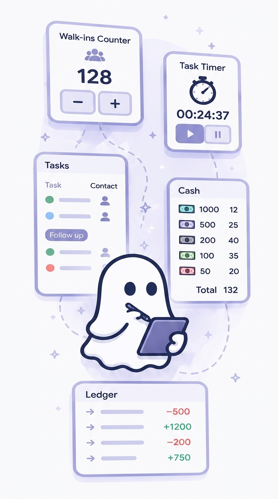
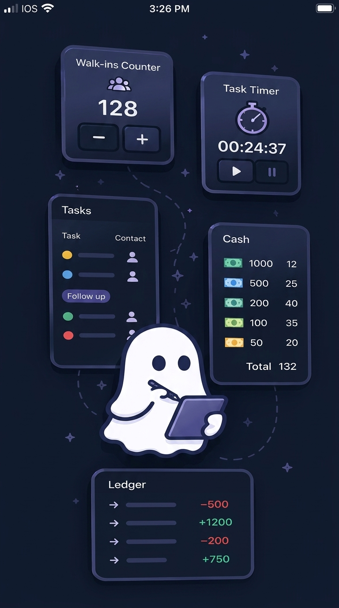

<div align="center">

</div>

<h1 align="center">Utilities</h1>

<p align="center">
  A comprehensive Progressive Web App with essential productivity tools for everyday use.
  <br />
  <a href="#features"><strong>Explore Features »</strong></a>
  <br />
  <br />
  
  
</p>

## ✨ Features

**🧮 Counter**
- Simple counting utility with increment, decrement, and reset functions
- Session persistence to maintain count across page refreshes

**⏱️ Timer**
- Precision stopwatch with start/pause/reset controls
- Displays time in minutes, seconds, and centiseconds

**📊 Tasks**
- Task management system with customizable tags
- Add detailed notes and organize tasks with color-coded categories
- Full CRUD operations with intuitive interface

**💵 Cash Calculator**
- Indian currency denomination calculator (₹500, ₹200, ₹100 notes)
- Track cash deposits with breakdown by denomination
- History view with detailed transaction records

**🧾 Expense Tracker**
- Record and track expenses with descriptions and dates
- Visual expense history with total spending summary
- Delete and manage expense entries

**⚙️ Settings**
- Dark/Light mode toggle with system preference detection
- Haptic feedback control for mobile devices
- Persistent settings stored locally

## 🚀 Getting Started

### Prerequisites

- **Node.js** (version 18 or higher)
- **npm** or **yarn** package manager

### Installation

1. **Clone the repository**
   ```bash
   git clone <repository-url>
   cd utility-hub-pwa
   ```

2. **Install dependencies**
   ```bash
   npm install
   ```

3. **Run the development server**
   ```bash
   npm run dev
   ```

4. **Open your browser**
   
   Navigate to [http://localhost:3000](http://localhost:3000) to view the app.

## 📱 Progressive Web App

This app is designed as a Progressive Web App (PWA) and can be installed on supported devices:

- **Desktop**: Click the install button in the address bar (Chrome/Edge) or use the app menu
- **Mobile**: Add to home screen from your browser menu
- **Features**: Offline functionality, app-like experience, push notifications ready

## 🛠️ Tech Stack

- **Framework**: [Next.js 16](https://nextjs.org/) with [React 19](https://react.dev/)
- **Language**: [TypeScript](https://www.typescriptlang.org/)
- **Styling**: [Tailwind CSS](https://tailwindcss.com/)
- **Database**: [Dexie](https://dexie.org/) (IndexedDB wrapper)
- **Animations**: [Motion](https://motion.dev/)
- **Icons**: [Lucide React](https://lucide.dev/)
- **PWA**: Service Worker implementation

## 🏗️ Build & Deployment

### Build for Production

```bash
npm run build
```

### Start Production Server

```bash
npm start
```

### Clean Build Cache

```bash
npm run clean
```

## 📋 Available Scripts

- `npm run dev` - Start development server
- `npm run build` - Create production build
- `npm run start` - Start production server
- `npm run lint` - Run ESLint
- `npm run clean` - Clean Next.js cache

## 🌟 Key Features

- **Offline-First**: Works without internet connection using local storage
- **Responsive Design**: Optimized for mobile and desktop
- **Dark Mode**: System-aware theme switching
- **Haptic Feedback**: Tactile responses on supported devices
- **Smooth Animations**: Fluid transitions and micro-interactions
- **Data Persistence**: All data stored locally in your browser

## 🤝 Contributing

Contributions are welcome! Please feel free to submit a Pull Request.

## 📄 License

This project is licensed under the MIT License - see the [LICENSE](LICENSE) file for details.

[](https://opensource.org/licenses/MIT)
